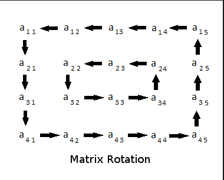

# matrixLayerRotation

## Intro
The project is a solution to the challenge >>Matrix Layer Rotation<<
posed on hackerrang. The subject can be reviewed following this
[LINK](https://www.hackerrank.com/challenges/matrix-rotation-algo/problem)



## Project overview
In addition to an implementation of an algorithm to solve the challenge, the
project furthermore contains input handling and error checking, also covering
edge cases. This ensures that the program terminates in a controlled manner
when wrong or invalid input is provided. Error messages feedback the user with
information on what aspect of the input was erroneous.

Moreover a testing suite is available covering different test cases:
- Overflows
- Non-numeric input
- Empty input
- Invalid input (according to the subject constraints on hackerrang)


A series of tests also verifies whether the algorithm works as intended and
the program outputs the expected results.


## Installation
The project is using C++11. 

Follow these steps to install:
1. Clone the repo
```
git clone git@github.com:u413-284-si/matrixLayerRotation.git
```
2. Change into the project directory
```
cd matrixLayerRotation
```
3. Compile the binary
```
make
```

## Usage
1. After successful compilation execute the program as follows (assuming you're
still in the project directory)
```
./rotateMatrix
```

2. Input the parameters defining the program conditions:
nRows nCols nRotations

- nRows = number of matrix rows
- nCols = number of matrix columns
- nRotations = number of rotations

3. Input the matrix

The user input shall follow these constraints:


Find hereafter an example of a correct input:


The program should provide following output:


### Testing
1. In order to run the test suite you need to compile the test binary
```
make test
```

2. Run the binary
```
./test
```

The various test cases will run consecutively and are displayed on the terminal.

### Cleanup
1. To remove the created object directory and with the compilation objects run
```
make clean
```

2. To remove the object directory and the program binary run
```
make fclean
```

3. To remove the object directory and test binary run
```
make tclean
```

## Contact & contribute

Feedback and/or fixes to improve the project are always welcome. Please leave
either an open issue or a merge request.
