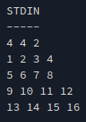

# matrixLayerRotation

## Intro
The project is a solution to the challenge <<Matrix Layer Rotation>>
posed on hackerrang.  

[LINK](https://www.hackerrank.com/challenges/matrix-rotation-algo/problem)

## Project overview
In addition to an implementation of an algorithm to solve the challenge, the
project furthermore contains input handling and error checking, also covering
edge cases. This ensures that the program terminates in a controlled manner
when wrong or invalid input is provided. Error messages feedback the user with
information on what aspect of the input was erroneous.

Moreover a testing suite is available covering different test cases:
- Overflows
- Non-numeric input
- Empty input
- Invalid input (according to the subject limitations on hackerrang)


A series of tests also verifies whether the algorithm works as intended and
the program outputs the expected results.


## Installation
The project is using C++11. 

Follow these steps to install:
1. Clone the repo
```
git clone git@github.com:u413-284-si/matrixLayerRotation.git
```
2. Change into the project directory
```
cd matrixLayerRotation
```
3. Compile the binary
```
make
```

## Usage
1. After successful compilation execute the program as follows (assuming you're
still in the project directory)
```
./rotateMatrix
```

2. Input the parameters defining the program conditions:
nRows nCols nRotations

with
- nRows = number of matrix rows
- nCols = number of matrix columns
- nRotations = number of rotations

3. Input the matrix

The user input shall follow these constraints


Find hereafter an example of a correct input:


The program should provide following output:

